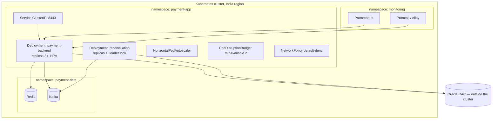
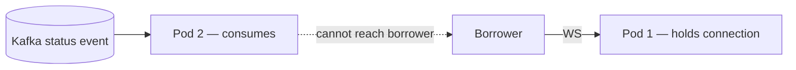

# Container and Deployment Architecture — LMS Repayment Platform

> Companion to *Proposed Architecture* and *Network Architecture*. Target design only.

---

## 1. Runtime shape

One deployable backend, horizontally scaled, with one exception: the reconciliation job
runs as a single leader. Everything else is stateless at the process level — all state
lives in Redis or Oracle.



**The reconciliation job is not a third replica of the app.** It is a separate deployment
with its own resource profile and its own leader lock, because its workload is long
batch queries against Oracle and vendor status APIs, and letting that share a pod with
latency-sensitive borrower traffic couples two things that should fail independently.

---

## 2. Image

### Build

Multi-stage. The build stage has a JDK, Maven and network access to registries. The
runtime stage has none of them.

```
Stage 1: maven:3.9-eclipse-temurin-25  → mvn package
Stage 2: runtime base                  → JRE + the jar, nothing else
```

The runtime stage must not contain Maven, a compiler, a shell package manager, curl,
wget, or the build cache. Every one of those is a tool an attacker uses after landing in
the container.

### Runtime base image

| Option | Trade-off |
|---|---|
| `gcr.io/distroless/java25-debian12` | smallest attack surface, no shell — hardest to debug |
| Red Hat UBI9 OpenJDK 25 | enterprise support and CVE feed, larger, has a shell |
| `eclipse-temurin:25-jre-alpine` | small and familiar, musl libc can surprise under load |

Recommendation: **distroless for prod, UBI9 if your security team requires a vendor CVE
feed with an SLA.** Not Alpine for a payment system — musl's allocator and DNS resolver
behave differently under load than glibc, and that difference shows up at month-end, not
in testing.

No shell means no `kubectl exec` debugging. That is a feature, and the reason the
observability document matters.

### Hardening

| Control | Setting |
|---|---|
| User | non-root, fixed numeric UID (e.g. 10001), no shell |
| Filesystem | `readOnlyRootFilesystem: true`, `emptyDir` on `/tmp` |
| Capabilities | drop ALL, `allowPrivilegeEscalation: false` |
| Seccomp | `RuntimeDefault` |
| Secrets | **never** in the image, never in `ENV`, never in a baked properties file |
| Tags | immutable digest pinning; never `:latest` |
| Provenance | signed with Cosign, verified by admission policy |
| Scanning | Trivy or Grype in CI, build fails on fixable HIGH/CRITICAL |
| Registry | private, in-region, no anonymous pull |

The secrets rule is not decorative. The application refuses to start without
`PAYMENT_TOKEN_HMAC_SECRET` and `PAYMENT_OTP_PEPPER`, and rejects placeholder-looking
values, precisely so that "it works in dev" cannot mean "it shipped with a default."
Those values come from the secrets manager at startup or via a mounted file, never from
the image.

---

## 3. JVM settings

```
-XX:MaxRAMPercentage=75.0
-XX:+UseG1GC
-XX:+UseCompactObjectHeaders
-XX:+ExitOnOutOfMemoryError
-XX:+HeapDumpOnOutOfMemoryError -XX:HeapDumpPath=/tmp
-Djdk.tracePinnedThreads=short        # non-prod only
```

Reasoning worth defending in review:

- **`MaxRAMPercentage`, not `-Xmx`.** A fixed heap ignores the container limit and
  produces OOMKills that look like application crashes.
- **`ExitOnOutOfMemoryError`.** A JVM that survives an OOM in a degraded state is worse
  than one that restarts. Kubernetes can restart a pod; it cannot fix a heap.
- **G1, not ZGC.** ZGC's pause profile is better, but G1 is the well-understood default
  at this heap size and this is not a latency-critical trading system. Revisit if p99
  pause time shows up in load testing.
- **A heap dump path on an ephemeral volume.** It will be lost on restart unless you ship
  it; decide now whether you want a sidecar that uploads it, because after the incident
  is too late.
- **`UseCompactObjectHeaders`** (JDK 25) typically reclaims 10–20% of heap on
  object-heavy workloads. Measure it rather than assuming; if the saving is real it may
  justify a smaller memory request per pod.
- **`tracePinnedThreads` in non-prod only.** JEP 491 removed synchronized-block pinning,
  but a native frame or a `Object.wait()` still pins. Cheap insurance while a new
  dependency beds in; noisy enough that it should not run in production.
- **Virtual threads are ON.** Safe from JDK 24 (JEP 491). The consequence is that the
  thread pool no longer bounds upstream concurrency, so `resilience4j.bulkhead` on the
  LMS and SMS clients is the only backpressure the platform has. See
  `CAPACITY_AND_PERFORMANCE.md` §2 before changing either limit.

---

## 4. Probes and lifecycle

| Probe | Endpoint | Purpose |
|---|---|---|
| startup | `/actuator/health/liveness` | covers slow first start; prevents premature liveness kills |
| liveness | `/actuator/health/liveness` | process is alive |
| readiness | `/actuator/health/readiness` | **includes Redis** |

Readiness including Redis is a deliberate choice with a sharp edge: if Redis goes down,
every pod goes NotReady and the service stops serving. That is correct — the application
cannot secure a payment journey without Redis and returns 503 anyway — but it means a
Redis outage is a total outage, visible in the availability numbers rather than hidden as
a 100% error rate. Make sure whoever owns the SLA knows this before it happens.

Shutdown sequence, which must line up or rolling deploys drop requests:

```
preStop: sleep 5s          ← ALB deregistration propagates
SIGTERM → graceful shutdown ← Spring stops accepting, drains in-flight
spring.lifecycle.timeout-per-shutdown-phase: 25s
terminationGracePeriodSeconds: 40   ← must exceed 5 + 25
```

The async executor drains within this window, so interaction records are not lost on a
rolling deploy. Audit ledger writes are synchronous and never depend on it.

---

## 5. Resource profile and scaling

Starting point, to be replaced by load-test numbers:

| | requests | limits |
|---|---|---|
| CPU | 500m | 2000m |
| Memory | 1Gi | 2Gi |

CPU limits on a JVM are contentious. A limit throttles under CFS quota and can produce
latency spikes that look like GC pauses; no limit risks a noisy neighbour. Set the limit
generously relative to the request and watch `container_cpu_cfs_throttled_seconds_total`
in load testing.

### Autoscaling

| Signal | Why |
|---|---|
| CPU 65% | baseline |
| **LMS bulkhead rejection rate** | **the real signal** — see the capacity document |
| Kafka consumer lag | for the posting consumers, not the API |

CPU alone is misleading: a request waiting on a slow LMS consumes no CPU while consuming
a bulkhead permit. With virtual threads, thread counts are misleading too — they will
look healthy at full saturation. Bulkhead rejections are the metric that reflects actual
capacity exhaustion.

Note what scaling out actually buys you here. Each new instance adds another 50 permits
against the *same* LMS, so horizontal scaling multiplies upstream load rather than
relieving it. `maxReplicas × bulkhead_limit` must stay inside whatever concurrency the
LMS has agreed to accept.

### The scaling limit nobody mentions

Horizontal scaling multiplies your load on the LMS and the SMS gateway. Ten pods at a
bulkhead of 50 means up to 500 concurrent LMS calls. Before setting `maxReplicas`,
confirm what the LMS will accept — scaling out into an upstream's ceiling converts your
capacity problem into their outage, which is slower to detect and harder to explain.

---

## 6. WebSocket — the stateful exception

The application architecture says "scale stateless app instances horizontally" and also
specifies a WebSocket push channel. Those two statements conflict, and the conflict has
to be resolved before implementation.

A WebSocket connection is pinned to one pod. The Kafka consumer that receives the status
event will frequently be on a different pod, which holds no connection to that borrower.



Three ways out:

| Option | Cost |
|---|---|
| Sticky sessions + Redis pub/sub fan-out to all pods | simplest; every pod receives every event and drops the ones it does not hold |
| External STOMP broker relay (RabbitMQ / ActiveMQ) | clean, another component to run and secure |
| Drop WebSocket, poll only | simplest of all; the status endpoint already exists |

Recommendation: **ship polling first, add push later.** The document already lists polling
as a fallback, payment status settles in seconds to minutes, and a 3-second poll on a
page the borrower is actively watching is not a load problem. Adding a broker relay to
save a poll is complexity spent in the wrong place while webhook signature verification
is still unbuilt.

If push is required for the product, the load balancer needs idle timeouts above the
WebSocket heartbeat interval, sticky sessions on the WS path, and the subscription must
verify `tvstxnid` ownership at subscribe time — not at first message.

---

## 7. Configuration and secrets

| Kind | Source | Example |
|---|---|---|
| Non-secret config | ConfigMap | timeouts, TTLs, vendor prefixes, topic names |
| Secrets | secrets manager via CSI driver or workload identity | HMAC secret, OTP pepper, DB password, actuator password, Kafka SASL |

Prefer workload identity over a bootstrap credential. A mounted static token to fetch
other secrets just moves the problem one hop.

Rotation, which needs a documented plan before go-live:

- **OTP pepper** cannot be rotated without invalidating every outstanding OTP. Rotate
  during a low-traffic window and accept that in-flight codes fail, or support two
  peppers during a transition.
- **Token HMAC secret** invalidates every outstanding payment token on rotation, so
  in-flight payments fail. Same treatment.
- Database and Kafka credentials rotate normally with a rolling restart.

---

## 8. CI/CD posture

```
commit → build + unit tests → SAST → dependency scan → image build
       → image scan → sign → deploy dev → integration tests → UAT → prod
```

Gates that should block a release:

- unit tests, including the crypto round-trip and token validation suites
- the session concurrency suite against a real Redis — currently disabled pending a CI
  Redis instance, and it is the only thing that verifies the compare-and-swap actually
  prevents lost updates
- the negative API tests: replayed nonce, missing anti-replay headers, cookie/header
  mismatch. If any of these starts returning 200, a security control has silently
  regressed
- dependency vulnerability scan with a fail threshold
- image scan with a fail threshold

Prod deploys are rolling with `maxUnavailable: 0`, behind the PodDisruptionBudget.

---

## 9. Backup and recovery

| Store | Backup | RPO | RTO |
|---|---|---|---|
| Oracle | RMAN plus Data Guard standby | near-zero | minutes with failover |
| Redis | **none needed** | n/a | session loss forces re-authentication |
| Kafka | replication factor 3 | n/a | not the system of record |

Redis deliberately has no backup. Everything in it is short-lived and reconstructible by
the borrower starting again. Restoring a stale Redis snapshot would be actively harmful —
it would resurrect consumed nonces, expired sessions and used OTPs.

Oracle retention and purging must be driven by the applicable log-retention obligation.
Both tables are interval-partitioned monthly so purging is a partition drop rather than a
very expensive `DELETE` over CLOBs. The purge runs as a separate privileged job; the
application user holds INSERT and SELECT only and cannot delete its own history.

---

## 10. Open items

1. Distroless or UBI9 — needs the security team's position on CVE feed requirements.
2. WebSocket: polling-first or broker relay. Blocks the ALB configuration.
3. Secrets manager choice and whether workload identity is available.
4. Oracle in-cluster or managed — affects the NetworkPolicy and the connection model.
5. `maxReplicas`, which cannot be set until the LMS tells you their concurrency ceiling.
6. Load-test-derived resource requests and limits. Everything in section 5 is a guess
   until then.
