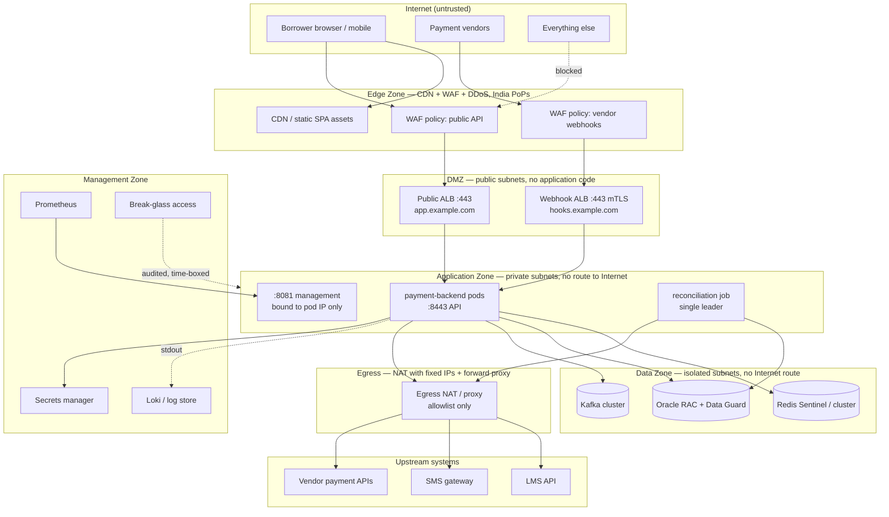
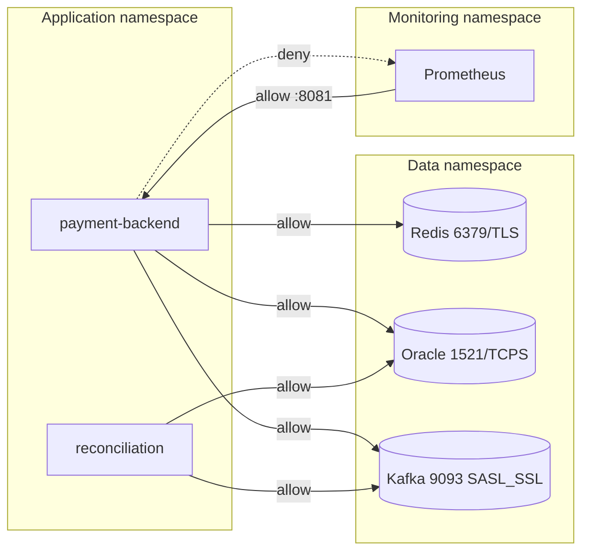

# Network Architecture — LMS Repayment Platform

> Companion to *Proposed Architecture — LMS Repayment Platform*. Target design only.
> Nothing here describes a current deployment.

---

## 1. Why this document exists separately

The application architecture answers *what the code does*. This answers *what can reach
what*, which is the question that determines blast radius when something is compromised.

Two design positions drive everything below:

1. **Three inbound paths, not one.** The borrower's browser, the payment vendors'
   callbacks, and the monitoring plane are three different trust populations with three
   different authentication mechanisms. Terminating them on the same listener means the
   weakest one defines the security of all three. Vendor callbacks in particular must
   never traverse the same WAF policy as the SPA.
2. **Default-deny in both directions.** Inbound default-deny is standard. Egress
   default-deny is the one people skip, and it is the control that turns a remote code
   execution into a contained incident rather than a data exfiltration.

---

## 2. Zone model



### Zone rules

| Zone | Internet inbound | Internet outbound | Holds borrower data |
|---|---|---|---|
| Edge | yes, by design | n/a | no — TLS terminates and re-originates |
| DMZ | yes, ports 443 only | no | in transit only |
| Application | never directly | only via egress proxy | yes, in memory |
| Data | never | never | yes, at rest |
| Management | never | no | metrics and logs only, no payloads |

**The application zone has no route to the Internet and no public IP.** Every outbound
call leaves through the egress proxy. A pod that tries to reach anything not on the
allowlist fails, and that failure is an alert.

---

## 3. Inbound path 1 — borrower traffic

```
Browser → DNS → CDN/WAF (India PoP) → Public ALB :443 → Pod :8443
```

| Layer | Responsibility | Notes |
|---|---|---|
| DNS | `app.example.com`, low TTL for failover | DNSSEC where the registrar supports it |
| CDN | serves the Angular bundle; API path passes through | SPA assets cached, `/api/*` never cached |
| DDoS | L3/L4 volumetric absorption | provider-managed |
| WAF | OWASP core rules, per-IP and per-session rate limits, bot rules | **this is where rate limiting lives** — the application has none by design |
| TLS | 1.3 preferred, 1.2 minimum, modern cipher suites only | HSTS with preload; `__Host-` cookie requires it |
| Public ALB | health checks, connection draining, sticky only for WebSocket | terminates and re-originates TLS to the pod |
| Pod | the application | mTLS from ALB to pod if the mesh provides it |

**Rate limiting is a WAF responsibility.** Two controls are deliberately *not* here and
cannot be: the OTP attempt cap and the per-agreement send budget both key on the
agreement number, which is inside an AES-GCM envelope the WAF cannot read. Those stay in
the application. Anyone who proposes moving them to the edge has not understood the
encryption model.

---

## 4. Inbound path 2 — vendor callbacks

This is the path most likely to be got wrong, because it is tempting to route it through
the same listener as everything else.

```
Vendor → WAF (webhook policy) → Webhook ALB :443 (mTLS) → Pod
```

| Control | Requirement |
|---|---|
| Hostname | separate FQDN, e.g. `hooks.example.com` — never the borrower hostname |
| Source | IP allowlist per vendor, maintained as config, reviewed quarterly |
| Transport | mutual TLS where the vendor supports it; client cert pinned per vendor |
| Message | HMAC or checksum signature verified in the application, constant-time compare |
| Replay | signature plus timestamp window plus idempotency key on `tvstxnid` |
| Authorisation | **no borrower session** — the vendor is not a borrower and must never carry one |
| Rate limit | separate, far lower ceiling than the public path |
| CORS | none — this endpoint is not called by a browser and should refuse preflight |

A vendor callback arriving on the public hostname should be rejected at the WAF, not
merely fail authentication in the application. Separate hostname, separate certificate,
separate policy, separate ALB target group.

**Non-negotiable:** the callback is the only external confirmation source for payment
status, so signature verification is the single highest-value control in the entire
platform. The legacy implementation had a `verifyGatewaySignature` method whose body was
`return true;` and whose result was then ignored. That is a forgeable payment success
reachable by anyone who can guess a transaction id.

---

## 5. Inbound path 3 — management

Prometheus scrapes `:8081`, which binds to the pod IP and is not exposed by any Service
or Ingress. Reachable only from the monitoring namespace, enforced by NetworkPolicy, and
authenticated with Basic credentials on top of that.

Two layers because network position alone is not authentication. In most clusters "on the
pod network" means every other pod, including anything an attacker lands in.

| Endpoint | Exposure | Auth |
|---|---|---|
| `/actuator/health/liveness` | kubelet only | none — probe runs before credentials exist |
| `/actuator/health/readiness` | kubelet only | none |
| `/actuator/prometheus` | monitoring namespace | Basic |
| everything else | not exposed | — |

---

## 6. Egress — the control people skip

Default-deny outbound, allowlisted by destination, through a NAT with **fixed source
IPs**. The fixed IPs matter twice: your vendors and your LMS will allowlist you, and a
NAT whose address changes breaks that silently.

| Destination | Protocol | Purpose | Timeout |
|---|---|---|---|
| LMS token + fetch endpoints | HTTPS 443 | agreement lookup | 30s read, 5s connect |
| SMS gateway | HTTPS 443 | OTP delivery | 15s read, 5s connect |
| Vendor payment APIs | HTTPS 443 | initiation, status query | per vendor |
| Secrets manager | HTTPS 443 | startup secret fetch | 5s |
| **Everything else** | — | **denied and alerted** | — |

No package registry access at runtime. No DNS resolution of arbitrary names — use a
resolver that only answers for allowlisted zones if the platform supports it. A pod that
suddenly resolves an unknown domain is one of the cheapest exfiltration signals you can
buy.

---

## 7. East-west traffic



Default-deny NetworkPolicy in every namespace. Every allowed flow is an explicit rule.
Data-tier ports accept connections only from the application namespace's service account.

All three data connections are encrypted in transit: Redis with TLS, Oracle with TCPS,
Kafka with SASL_SSL. "It's on a private subnet" is not encryption, and the session AES
keys and full LMS payloads both travel these links.

---

## 8. Firewall matrix

The table a CTO will actually read.

| # | Source | Destination | Port | Protocol | Purpose |
|---|---|---|---|---|---|
| 1 | Internet | CDN/WAF | 443 | TLS 1.2+ | borrower traffic |
| 2 | WAF | Public ALB | 443 | TLS | filtered borrower traffic |
| 3 | Vendor allowlisted IPs | Webhook ALB | 443 | mTLS | payment callbacks |
| 4 | Public ALB | App pods | 8443 | TLS | API |
| 5 | Webhook ALB | App pods | 8443 | TLS | callbacks |
| 6 | kubelet | App pods | 8081 | HTTP | liveness/readiness |
| 7 | Monitoring ns | App pods | 8081 | HTTP + Basic | metrics scrape |
| 8 | App pods | Redis | 6379 | TLS | session, nonce, OTP, token cache |
| 9 | App pods | Oracle | 1521 | TCPS | audit, payment, interaction log |
| 10 | App pods | Kafka | 9093 | SASL_SSL | event fan-out |
| 11 | App pods | Egress NAT | 443 | TLS | LMS, SMS, vendors, secrets |
| 12 | Egress NAT | LMS / SMS / vendor ranges | 443 | TLS | upstream calls |
| 13 | Bastion | App/Data zones | 22 / 1521 | SSH / TCPS | break-glass, time-boxed and recorded |
| — | **any other flow** | — | — | — | **denied** |

---

## 9. High availability and failure domains

| Component | Topology | Failure behaviour |
|---|---|---|
| App pods | ≥3, spread across ≥2 AZs, PodDisruptionBudget min 2 | ALB drains, rolling deploy |
| Redis | Sentinel or managed cluster, multi-AZ, automatic failover | **service returns 503** — see below |
| Oracle | RAC plus Data Guard standby | pool retries; audit writes fail loudly |
| Kafka | ≥3 brokers, RF 3, min.insync.replicas 2 | producer buffers then drops metadata; no borrower impact |
| Reconciliation | single leader via distributed lock | another instance takes over on lease expiry |

**Redis availability equals service availability, deliberately.** Session state, nonces,
OTP hashes and CAS versions live only there, with no local fallback. The alternative —
degrading to per-node state — silently disables replay protection, attempt counting and
the compare-and-swap across a load-balanced cluster, which is worse than being down. Size
and monitor Redis as a tier-one dependency, not a cache.

---

## 10. Data residency

All zones deploy in India regions only. This is a hard constraint, not a preference:
payment system data and borrower data must be stored in India, and ICT logs retained in
India. Practical consequences:

- no cross-region replication of Oracle, Redis, Kafka or object storage outside India
- log aggregation and metrics storage in-region
- CDN PoPs may serve static assets globally, but `/api/*` must not be cached anywhere
- managed services must be confirmed to keep control-plane metadata in region
- any vendor or SaaS in the path needs the same confirmation in writing

---

## 11. Environments

| Environment | Data | Network posture |
|---|---|---|
| dev | synthetic only | relaxed egress, no production upstream credentials |
| test | synthetic only | production-shaped policies, stubbed upstreams |
| UAT | masked or synthetic | production-shaped, UAT upstream endpoints |
| prod | live | everything in this document |

Plaintext payload mode and LMS payload logging are startup-blocked outside dev and test.
No environment below prod holds real borrower data — if UAT needs realistic data, it gets
masked data, not a production copy.

---

## 12. Open items

These need answers before this design can be signed off.

1. Do the vendors support mTLS, and what are their callback source ranges?
2. Does the SMS provider offer a POST endpoint? The current GET puts the OTP in a query
   string, which lands in access logs on hops outside your control.
3. Is the LMS reachable over a private link, or does it require public egress?
4. Which secrets manager, and does it support workload identity rather than a bootstrap
   credential?
5. Confirmed log retention period and storage location.
6. WebSocket termination — see the deployment document; this materially affects the load
   balancer configuration.
